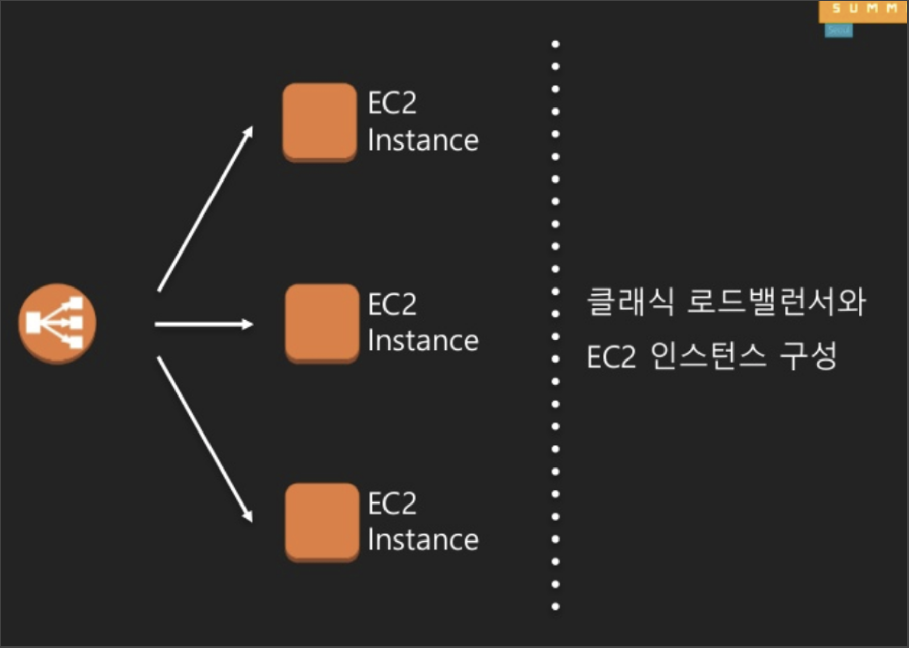

# AWS Elastic Load Balancer

- AWS에서 제공하는 L4 스위치 기능을 제공하는 로드 밸런싱 서비스

- ELB가 받은 요청을 해당하는 EC2 인스턴스, 서비스 그룹 등 다양하게 전달 할 수 있다.

- 너무 많은 요청을 처리하고 있거나, 정상적으로 작동하지 않는(helth-check) 서버에는 요청을 보내지 않는다(고가용성 보장).

- 미니멀 한 기능을 제공하는 Classic LB, 좀 더 안정적으로 발전한 Network LB, URL/domain/service(Layer 7) 단위로 분산할 수 있는 Application LB가 있음

- 로드밸런서 종류는 내부/외부가 존재하고, 내부 로드밸런서로 선택하면 VPC 내부망에서만 접근이 가능하다.

# AWS Auto Scaling Group

- Auto Scaling Group은 미리 빌드한 AMI를 기반으로 EC2 인스턴스를 자동으로 생성할 수 있다.

- 특정 상황일 때 scale-out을 위한 조정정책을 설정할 수 있다
    + CPU 사용량, 시간등 에 따라 인스턴스 자동 생성 및 삭제
    + 인스턴스 증가/삭제 시 최대/최 개수 지정
    + 측정치에 도달했을 때 알림 기능

### ASG 응용방법

- CPU, 메모리, 네트워크 지표를 통해 갑작스럽게 몰려드는 요청이나 특정 인스턴스가 장애가 나더라도 사람이 직접 나서기 전에 장애를 대처할 수 있다.

- ASG가 발동됐을 때 알림을 통해 장애가 발생한 포인트를 체크할 수 있다.
 
- 서비스의 사람이 몰릴 수 있는 시간에 대한 예측을 통해을 ASG 최소/최대 값을 설정하여 서버비용을 효율적으로 관리할 수 있다.

