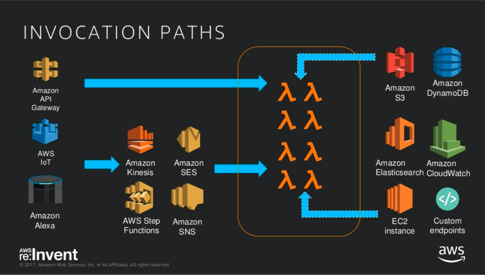

# AWS Lambda

- 서버를 고려하지 않고 애플리케이션과 서비스 구축, 실행
- 간단한 설정 저렴한 비용 충분한 성능
- AWS 타 기능 통합

### Life Cycle

- Lambda 컨테이너 생명 주기를 AWS가 관리
    + 개발자가 컨테이너 생성/소멸 시점을 알 수 없음
- 하나의 컨테이너는 하나의 lambda 함수 실행만 가능. 
- 반복적으로 실행되면 컨테이너를 재활용
- 한번 실행 후, 일정 시간 실행되지 않으면 컨테이너는 소멸 
- 소멸 후 재 실행 시 재생성, 지연 발생 (cold-start)
- 기본 설정 값은 VPC 사용 안함. 사용 시 추가 지연 및 제한 
- 사설망 접근 필요 시 IP 할당 제한 및 ENI 생성 지연