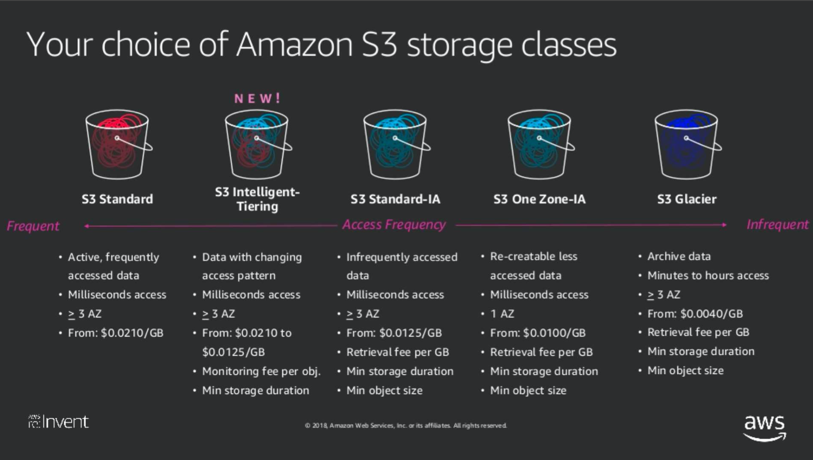

# AWS S3 (Simple Storage Service)

- 높은 내구/확장/가용성 저렴한 비용
- 보안 및 규제 준수 AWS 타 기능 통합

## Storage Service

- 물리서버로 치면 저장할 때 HDD,SDD 혹은 Nas 서버를 선택해서 파일서버를 구축하는데 S3도 마찬가지로 다음과 같은 종류로 정할 수 있음

> EBS
- Elastic Block Store
- EC2 에서 사용할 block storage
- 할당된 크기 비례 성능

> EFS
- Elastic File System
- 서버간 공유 파일 시스템(NFSv4.1) 
- 할당된 크기 비례 성능 

## Storage Class

