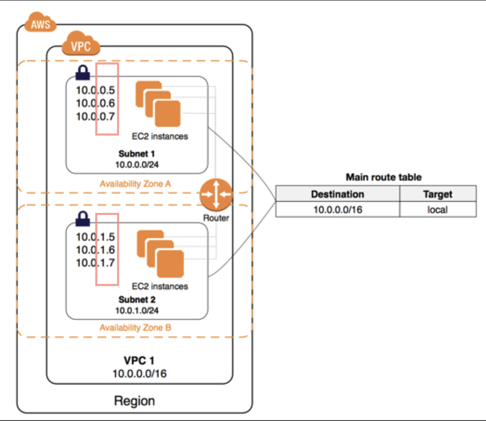
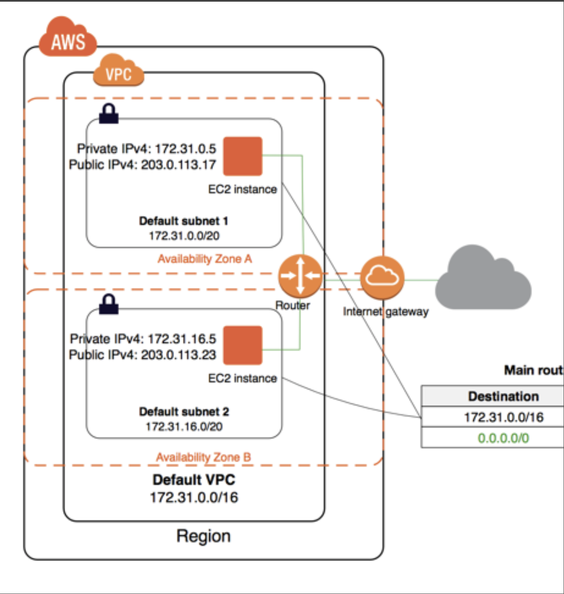

# 용어

### AWS Region

- 세계 각지에 위치한 AWS IDC
- AWS의 서비스가 위치한 지리적인 장소이며, 글로벌 기준으로 지역적 위치를 묶어서 관리하는 단위
- 사용자와 가까운 위치에 있는 리전일수록 응답속도가 빠름 하나의 리전은 여러 개의 가용 영역(AZ)로 구성된다

### 가용영역 AZ(Availability Zone)

- 하나의 리전은 물리적으로 독립된 여러 곳의 IDC(가용 영역)으로 구성 
- 가용 영역은 low latency link로 연결되어 물리적으로 떨어져 생기는 네트워크 latency를 보장
- 리전 / AZ를 통해 손 쉽게 멀티 IDC를 운영하는 이점을 가질 수 있음
- AZ = IDC (물리적으로 독립된 실제 컴퓨팅(베어메탈)이 운영되는 곳

### VPC(Virtual Private Cloud)

- 한 리전 내 여러 가용 영역 을 걸쳐 논리적으로 분리하 여 독립적으로 구성한 AWS 계정 전용 가상 네트 워크

- AWS에서 기본으로 제공하는 논리적 가상 네트워크
- 한 리전 내 여러 가용 영역을 걸쳐 운영 가능
- 필요한 경우 네트워크를 만들어 Private subnet, Public subnet 을 운용할 수 있다
- Public subnet 내 인스턴스는 외부 인터넷과 통신 가능한 public IP와 VPC 안에서만 사용 가능한 private IP를 할당받는다 (Private subnet 내 인스턴스는 private IP만 할당받는다)

> 특징
- 다른 계정에서 AWS 리소스 격리 
- 인스턴스와의 네트워크 트래픽 라우팅 
- 네트워크 침입으로부터 인스턴스 보호 
- 한 리전에선 최대 5개의 VPC 생성 가능 

### Subnet

- VPC의 ip 주소 범위
- IP block을 구분 짓는 네 트워크 구성 그룹
- 각 가용 영역에 하나 이상의 서브넷 생성 가능
- 지정된 서브넷으로 AWS 리 소스(EC2, RDS 등) 실행

## Network

- 기본 VPC로 설정시 각각의 기본 서브넷은 Public subnet으로 구성됨
- public subnet에 구축된 AWS 인스턴스엔 public/ private ip가 각각 부여됨 
- AWS Internet gateway를 통해 외부 인터넷에 연결

- 라우팅 테이블 정보는 AWS vpc 에서 확인 할 수 있음.